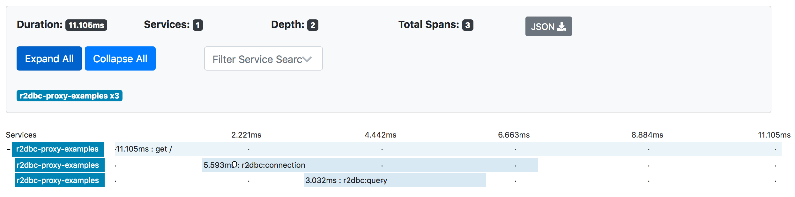
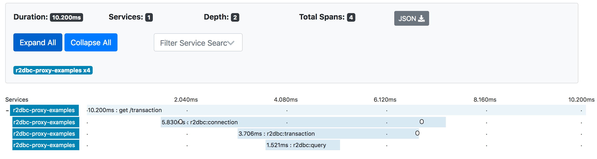
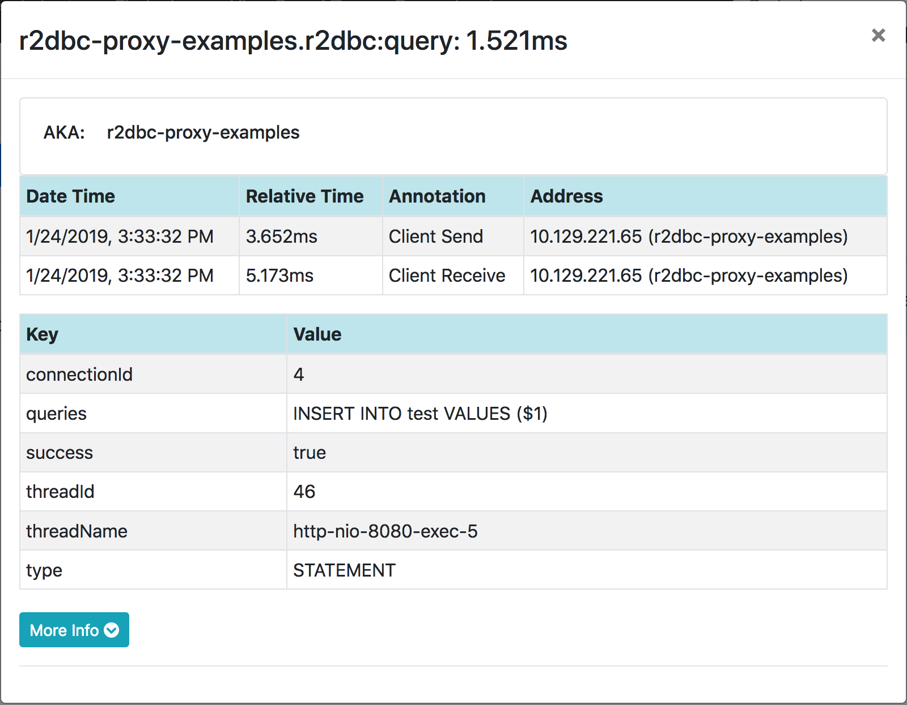
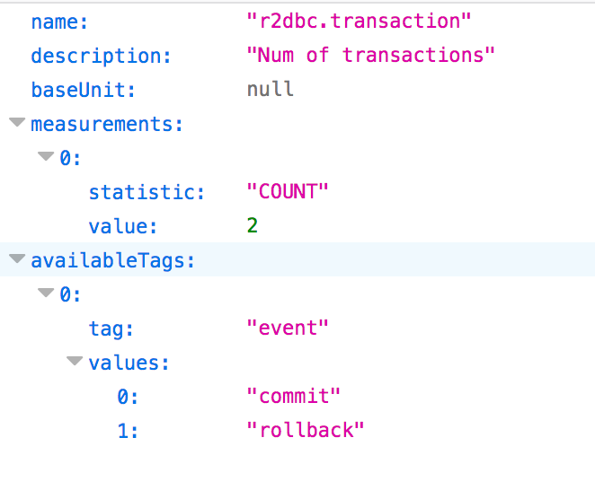
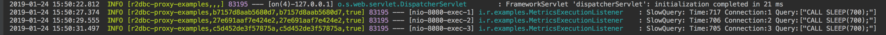

# r2dbc-proxy-samples

[r2dbc-proxy][r2dbc-proxy] sample projects.

## Samples

- Tracing with Sleuth
- Metrics with Micrometer (and log slow query)

## Tracing with Sleuth

**[TracingExecutionListener](./src/main/java/io/r2dbc/examples/TracingExecutionListener.java)** :
_Instrument R2DBC interaction to create tracing spans_. 


### Sample tracing images

Tracing query



Tracing transaction



Tracing transaction rollback


Connection Span


Transaction Span


Quey Span (Single Query)



Quey Span (Batch Query)


## Metrics with Micrometer (and log slow query)

**[MetricsExecutionListener](./src/main/java/io/r2dbc/examples/MetricsExecutionListener.java)** :
_Populates following metrics:_

- Time took to create a connection
- Commit and rollback counts
- Executed query count
- Slow query count

Metrics are accessible via JMX and metrics endpoint(`/actuator/metrics`).

Also, logs slow queries that took more than 500ms.


## Sample metrics images

*JMX entries:*


*Connection metrics on JMX:*


*Query metrics on JMX:*


*Connection metrics on actuator (`/actuator/metrics/r2dbc.connection`):*


*Transaction metrics on actuator (`/actuator/metrics/r2dbc.transaction`):*



*Slow query log:*


----

# How to run

Start zipkin
```shell
> docker run -d -p 9411:9411 openzipkin/zipkin
```

Start `Application`

Access endpoints
```shell
> curl localhost:8080
> curl localhost:8080/batch
> curl localhost:8080/transaction
> curl localhost:8080/rollback
> curl localhost:8080/slow
```

Metrics actuator endpoint

```shell
> curl localhost:8080/actuator/metrics
```

----

[r2dbc-proxy]: https://github.com/r2dbc/r2dbc-proxy
[LifeCycleListener]: https://github.com/r2dbc/r2dbc-proxy/blob/master/src/main/java/io/r2dbc/proxy/listener/LifeCycleListener.java
